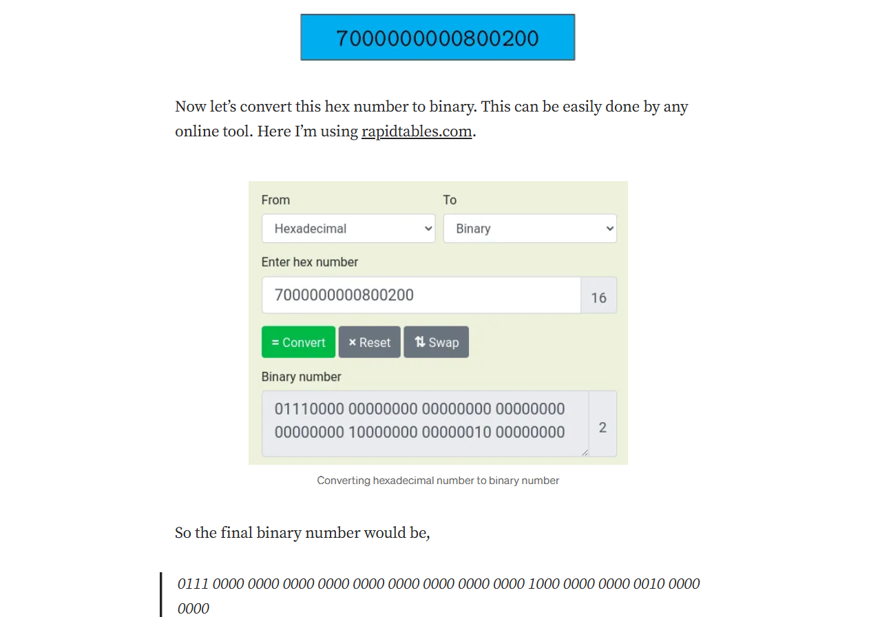

**ISO-8583** is a standard used in the financial industry for **electronic funds transfer** messages, 
and jPOS is an open-source implementation that supports this standard along with ISO-20022, ANS X9.24, EMV, and others. 
It provides a Java-centric solution for payment gateways, acquirer, and issuer applications, making it useful for financial transactions globally.

**ISO 8583 messages** are used to transfer financial messages over the network. 
Typically between automated teller machines (ATM) or point of sale (POS) devices and banks transfer information through ISO 8583 messages.

### **Structure of the ISO 8583 message**

### Message Structure
ISO 8583 message basically has 4 parts.

1. Header
2. Message Type Identifier (MTI)
3. Bitmap
4. Data Fields

### Header 
Header can be any value and it’s not mandatory. But before transmitting the message, all involved parties should agree the length of the header.
So the header can be empty too. In this case, header length is 7.

### Message Type Identifier (MTI)
The MTI is a 4-digit number that indicates the type of transaction being performed.

### Bitmap
The bitmap is a 64-bit binary number that indicates which data fields are present in the message.
The bitmap is divided into two parts: the primary bitmap and the secondary bitmap.
The primary bitmap is the first 64 bits of the message, and it indicates which of the first 64 data fields are present.
The secondary bitmap is the next 64 bits of the message, and it indicates which of the next 64 data fields are present.

### Data Fields
This section contains the actual information of the transaction. Data fields definitions need to be defined beforehand to correctly parse data.

### Summary

